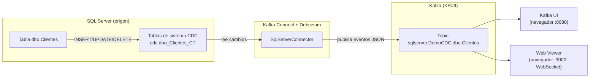

# Demo CDC: SQL Server → Kafka Connect (Debezium) → Kafka → Kafka UI / Web Viewer

Demo local, **ejecutable y didáctica**, que muestra cómo capturar cambios
(**Change Data Capture**) desde **SQL Server** y publicarlos en **Kafka** usando
**Kafka Connect + Debezium**, todo orquestado con **Docker Compose**.

Verás en acción:

- 📸 **Snapshot inicial** de los datos existentes.
- ➕ Eventos de **INSERT** (`op = "c"`).
- ✏️ Eventos de **UPDATE** (`op = "u"`, con `before`/`after`).
- ❌ Eventos de **DELETE** (`op = "d"`) + *tombstone*.
- 👀 Visualización de los mensajes en **Kafka UI**.
- 📡 **Streaming en vivo** de cada evento en un panel web propio
  ([web-viewer](web-viewer/), vía WebSocket) — ideal para presentar la demo.

---

## 1. Objetivo de la demo

Demostrar, de forma reproducible y sin infraestructura previa, el patrón CDC:
un cambio en una tabla de SQL Server aparece automáticamente como un mensaje
en un topic de Kafka, sin modificar la aplicación que escribe en la base de datos.

---

## 2. Arquitectura (resumen)



Detalle completo en [docs/01-arquitectura.md](docs/01-arquitectura.md) y en el
diagrama [docs/diagrama-arquitectura.md](docs/diagrama-arquitectura.md)
(+ archivo importable [docs/diagrama-arquitectura.drawio](docs/diagrama-arquitectura.drawio)).

---

## 3. Prerequisitos

| Requisito | Notas |
|---|---|
| **Docker Desktop** (o Docker Engine) con **Docker Compose v2** | `docker compose version` debe funcionar. |
| **~4 GB de RAM libres** | SQL Server es el servicio más pesado. |
| Puertos libres: **1433, 8083, 8080, 9092, 3000** | Cámbialos en `.env` si están ocupados. |
| (Opcional) **Git Bash / WSL** | Solo si prefieres los scripts `.sh`. En Windows puedes usar los `.ps1`. |

> **Windows:** todos los scripts existen en dos variantes: `.sh` (Git Bash/WSL/Linux/macOS)
> y `.ps1` (PowerShell nativo). Usa la que prefieras.

---

## 4. Estructura del proyecto

```text
cdc-sqlserver-kafka-debezium/
├─ docker-compose.yml            # Toda la infraestructura (5 servicios)
├─ .env.example                  # Variables de entorno (copiar a .env)
├─ .gitignore
├─ README.md                     # Este archivo
│
├─ sql/                          # Scripts de base de datos
│  ├─ 01-init.sql                #   crea BD + tabla + habilita CDC
│  ├─ 02-seed.sql                #   datos semilla (aparecen en el snapshot)
│  ├─ 03-test-insert.sql         #   prueba INSERT (op = "c")
│  ├─ 04-test-update.sql         #   prueba UPDATE (op = "u")
│  └─ 05-test-delete.sql         #   prueba DELETE (op = "d")
│
├─ connect/                      # Configuración de Kafka Connect / Debezium
│  ├─ sqlserver-source-connector.json   # config del connector (comentada)
│  ├─ register-connector.sh              # registra el connector (bash)
│  └─ register-connector.ps1             # registra el connector (PowerShell)
│
├─ scripts/                      # Utilidades
│  ├─ wait-for-services.sh/.ps1  #   espera a que todo esté "healthy"
│  ├─ apply-sql.sh/.ps1          #   ejecuta un .sql dentro de SQL Server
│  ├─ consume-topic.sh/.ps1      #   lee mensajes del topic por consola
│  └─ run-demo.ps1               #   orquestador "todo en uno" (Windows)
│
├─ web-viewer/                   # Panel web de streaming en vivo (WebSocket)
│  ├─ Dockerfile
│  ├─ package.json
│  ├─ server.js                  #   consumer Kafka -> WebSocket
│  ├─ public/                    #   frontend vanilla (HTML/CSS/JS)
│  └─ README.md                  #   detalle de este servicio
│
└─ docs/                         # Documentación y diagramas
   ├─ 01-arquitectura.md
   ├─ 02-paso-a-paso.md
   ├─ 03-analisis.md
   ├─ diagrama-arquitectura.md   # diagramas Mermaid
   └─ diagrama-arquitectura.drawio
```

---

## 5. Puesta en marcha rápida (TL;DR)

### Opción A — Windows PowerShell (un solo comando)

```powershell
# Desde la raíz del proyecto:
Copy-Item .env.example .env      # 1. crea tu .env
./scripts/run-demo.ps1           # 2. levanta todo, prepara BD y registra connector
```

### Opción B — Paso a paso (cualquier SO)

```bash
# 1) Crea tu .env a partir del ejemplo
cp .env.example .env             # Windows: copy .env.example .env

# 2) Levanta la infraestructura
docker compose up -d

# 3) Espera a que todo esté "healthy"
./scripts/wait-for-services.sh   # o .ps1

# 4) Inicializa SQL Server (crea BD, tabla, CDC y datos semilla)
./scripts/apply-sql.sh           # o .ps1  -> aplica 01-init.sql + 02-seed.sql

# 5) Registra el connector Debezium
./connect/register-connector.sh  # o .ps1
```

La guía **detallada y explicada** está en [docs/02-paso-a-paso.md](docs/02-paso-a-paso.md).

---

## 6. Cómo validar que funciona

1. **Estado de los contenedores:**
   ```bash
   docker compose ps
   ```
   Todos deben aparecer como `running` / `healthy`.

2. **Estado del connector** (debe decir `RUNNING`):
   ```bash
   curl http://localhost:8083/connectors/sqlserver-clientes-connector/status
   ```

3. **Abre Kafka UI:** <http://localhost:8080>
   - Ve a **Topics** → busca `sqlserver.DemoCDC.dbo.Clientes`.
   - Deberías ver **3 mensajes** del snapshot inicial (los datos semilla, `op = "r"`).

4. **Abre el Web Viewer:** <http://localhost:3000>
   - El punto de conexión debe pasar a verde ("Conectado").
   - Deberías ver 3 cards de tipo `SNAPSHOT` con los clientes semilla.

5. **O por consola:**
   ```bash
   ./scripts/consume-topic.sh    # o .ps1
   ```

---

## 7. Cómo registrar el connector

El connector se define en
[connect/sqlserver-source-connector.json](connect/sqlserver-source-connector.json)
(cada parámetro está comentado) y se registra con:

```bash
./connect/register-connector.sh     # o register-connector.ps1
```

Internamente hace un `POST http://localhost:8083/connectors` con ese JSON.
Para **borrarlo** y volver a empezar:

```bash
curl -X DELETE http://localhost:8083/connectors/sqlserver-clientes-connector
```

---

## 8. Cómo probar cambios en SQL Server

Ejecuta los scripts de prueba (uno a uno) y observa los nuevos mensajes:

```bash
./scripts/apply-sql.sh 03-test-insert.sql    # INSERT -> op = "c"
./scripts/apply-sql.sh 04-test-update.sql    # UPDATE -> op = "u"
./scripts/apply-sql.sh 05-test-delete.sql    # DELETE -> op = "d" (+ tombstone)
```

> Tras cada script, refresca el topic en Kafka UI o mira la consola de
> `consume-topic`. Verás aparecer el evento correspondiente casi al instante.

También puedes conectarte con **Azure Data Studio / SSMS** a `localhost:1433`
(usuario `sa`, la contraseña de tu `.env`) y escribir tus propios `INSERT/UPDATE/DELETE`.

---

## 9. Cómo visualizar los mensajes

- **Web Viewer** (recomendado para presentar la demo): <http://localhost:3000>
  - Streaming en vivo vía WebSocket: cada evento aparece como una card animada,
    con contadores por tipo de operación y un mini-gráfico de actividad.
  - En los `UPDATE` resalta qué campos cambiaron (`before → after`).
  - Detalle técnico en [web-viewer/README.md](web-viewer/README.md).
- **Kafka UI**: <http://localhost:8080> → *Topics* → tu topic → *Messages*.
  - Cada mensaje tiene una **key** (la PK del cliente) y un **value** con la
    estructura Debezium: `payload.before`, `payload.after`, `payload.op`, `payload.source`.
- **Consola:** `./scripts/consume-topic.sh` (o `.ps1`).
- La **anatomía de un mensaje** está explicada en [docs/02-paso-a-paso.md](docs/02-paso-a-paso.md#anatomia-de-un-evento).

---

## 10. Problemas comunes (troubleshooting)

| Síntoma | Causa probable | Solución |
|---|---|---|
| El connector queda en `FAILED` con error de login | Contraseña de `.env` ≠ la del JSON del connector | Sincroniza `MSSQL_SA_PASSWORD` (`.env`) y `database.password` (JSON). |
| `Could not connect ... SSL/TLS` | SQL 2022 fuerza TLS | Ya lo evitamos con `database.encrypt=false` + `trustServerCertificate=true`. |
| No aparecen mensajes de UPDATE/DELETE | SQL Agent no arrancó → sin capture jobs | Verifica `MSSQL_AGENT_ENABLED=true` y reinicia; revisa `docker compose logs sqlserver`. |
| `sp_cdc_enable_db` falla | La BD aún no existía / Agent no listo | Reejecuta `apply-sql` cuando el contenedor esté `healthy`. |
| Puerto ocupado al hacer `up` | 1433/8080/8083/9092 en uso | Cambia el puerto host en `.env`. |
| El topic no existe | El connector no se registró o falló el snapshot | `curl .../status` y revisa `docker compose logs connect`. |
| Web Viewer muestra "Desconectado" | El contenedor `web-viewer` no arrancó o Kafka no estaba listo aún | `docker compose logs web-viewer`; reintenta con `docker compose restart web-viewer`. |

Más detalle en [docs/02-paso-a-paso.md](docs/02-paso-a-paso.md#troubleshooting).

---

## 11. Apagar y reiniciar la demo

```bash
# Parar los contenedores (conserva los datos/volúmenes):
docker compose stop

# Arrancarlos de nuevo:
docker compose start

# Parar y ELIMINAR contenedores + red (conserva volúmenes):
docker compose down

# Empezar TOTALMENTE de cero (borra también los datos):
docker compose down -v
```

> Tras `down -v` tendrás que volver a ejecutar `apply-sql` y `register-connector`.

---

## 12. Documentación adicional

- [docs/01-arquitectura.md](docs/01-arquitectura.md) — arquitectura y flujo de datos.
- [docs/02-paso-a-paso.md](docs/02-paso-a-paso.md) — guía detallada, comandos y troubleshooting.
- [docs/03-analisis.md](docs/03-analisis.md) — decisiones de diseño, límites y mejoras.
- [docs/diagrama-arquitectura.md](docs/diagrama-arquitectura.md) — diagramas Mermaid.
- [docs/diagrama-arquitectura.drawio](docs/diagrama-arquitectura.drawio) — diagrama editable en draw.io.
- [web-viewer/README.md](web-viewer/README.md) — detalle del panel de streaming en vivo.
